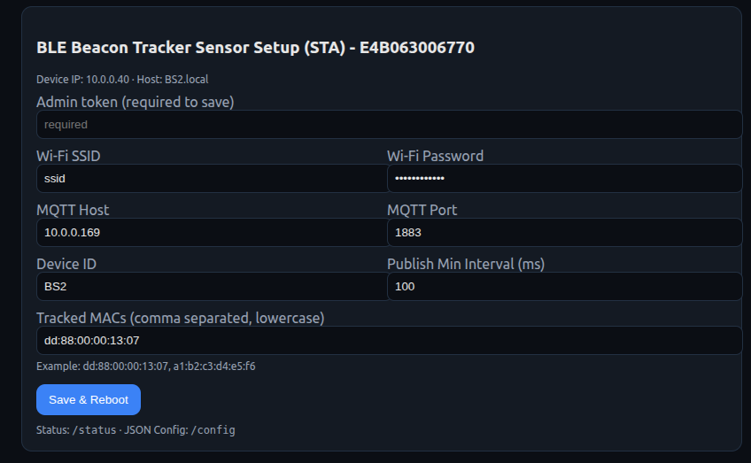
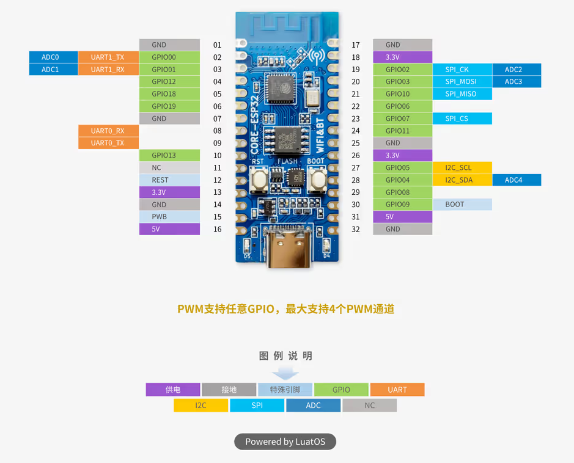

# BLE Beacon Tracker Firmware

Firmware for the [ACEIRMC ESP32-C3](https://a.co/d/elhNUnP) board that scans for BLE [beacons](https://a.co/d/0BsrPjJ), smooths RSSI values, and publishes results via MQTT or exposes them through a web interface. Designed for indoor localization and triangulation applications, with robust Wi-Fi handling and an easy-to-use provisioning web UI.

---

## Features

- 🔎 **BLE Scanning (NimBLE)**  
  Scans advertisements for a configurable list of MAC addresses.  
  - Exponential Moving Average (EMA) smoothing per device  
  - Configurable publish interval (`pubMs`)  

- 📡 **Wi-Fi Station + Provisioning AP**  
  - On first boot (or if SSID is not set), device enters AP mode.  
  - SoftAP SSID: `C3-Setup-<deviceMAC>`
  - SOftAP URL: `192.168.4.1`
  - Web UI at `http://<deviceID>.local/` to configure Wi-Fi, MQTT, and tracked MACs.  
  - AP mode can also be entered at any time by long-pressing the AP trigger push button.  

- **Web UI**  
  - HTML form to configure Wi-Fi / MQTT / beacon list  
  - Pre-populated with current settings from NVS  
  - Endpoints:  
    - `/` → Configuration form  
    - `/status` → JSON device status  
    - `/config` → JSON config save API  

- **MQTT Publishing**  
  - Each beacon update is published as JSON:  
    ```json
    {
      "sensor_mac"  : "xx:xx:xx:xx:xx:xx",
      "sensor_id"   : "BS<X>",
      "beacon_mac"  : "dd:88:00:00:13:07",
      "rssi"        : [0, -120],
      "rssi_ema"    : [0, -120],
      "ts_unix"     : "UTC timestamp",
      "ts_ms"       : "runtime",
      "ip"          : "sensor_local_ip"
    }
    ```
  - Topics:  
    - `sensors/ble/` for beacon updates
    - `sensors/ble/<deviceId>/status` for online/offline state

- **SNTP Time Sync**  
  - Fetches UTC from `pool.ntp.org`, `time.nist.gov`, `time.google.com`  
  - Provides `ts_unix` and `ts_ms` fields in messages  

- **LED Status Indicator** (default `D5` → GPIO12)  
  - **Acces Point Mode:** solid ON  
  - **Connecting:** fast blink (~2 Hz)  
  - **Online:** heartbeat pulse every 10 s  

- **Robust Operation**  
  - If Wi-Fi connection fails, retries for 15 s  
  - On failure: **auto-reboots** to retry  
  - AP mode is only entered when triggered via button  

---

## Hardware
- **BLE Beacon:** [Bluecharm Beacon](https://a.co/d/0BsrPjJ)
- **Board:** [ACEIRMC ESP32-C3](https://a.co/d/2U9gScU)
- **CPU:** ESP32-C3 (single-core, 160 MHz, Wi-Fi + BLE 5.0 LE)  
- **Flash:** 4 MB  
- **USB:** Native USB-CDC for programming and serial output  
- **Pins used:**  
  - `GPIO12` → LED indicator  
  - `GPIO2`  → AP trigger button (active LOW, hold ≥1s)  

---

## Build & Flash (PlatformIO)

Install [PlatformIO](https://platformio.org/) and clone this repo.

```bash
pio run -t upload
pio device monitor
```


## Usage

### First boot (factory default)
- Device enters SoftAP mode (`C3-Setup-XXXXXX`)
- Connect with phone/laptop to its WiFi → open [http://192.168.4.1/](http://192.168.4.1/)
- Fill in Wi-Fi SSID, password, MQTT host/port, and beacon MAC list (Ask [developer](moniruzzaman.akash@unh.edu) for the token)



### Normal boot
- Device tries Wi-Fi → connects to MQTT → starts BLE scanning
- Publishes beacon data to broker

### Force AP provisioning (anytime)
- Hold the AP trigger button (**GPIO2 → GND**) for ≥1s
- LED solid **ON** indicates AP mode

## Resources

### ACEIRMC ESP32-C3 Pinout


## TODO / Future Improvements
- Add OTA firmware update
- Add beacon QR code scanner on Web UI
- UUID based filtering

## License

Licensed under the Apache License 2.0

Copyright © 2025 Moniruzzaman Akash, CARL-University of New Hampshire

